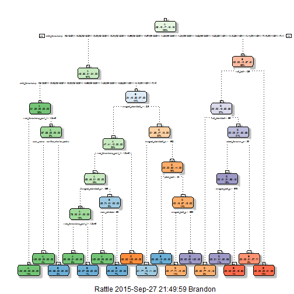
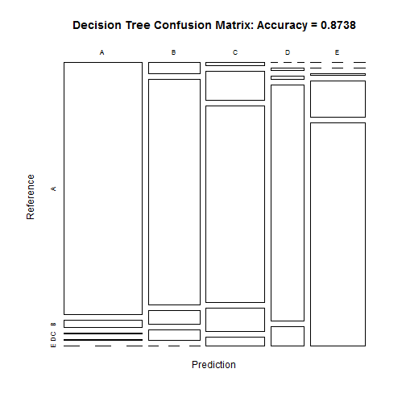

# Coursera Practical Machine Learning Project

## Introduction


Using devices such as Jawbone Up, Nike FuelBand, and Fitbit it is now possible to collect a large amount of data about personal activity relatively inexpensively. These type of devices are part of the quantified self movement - a group of enthusiasts who take measurements about themselves regularly to improve their health, to find patterns in their behavior, or because they are tech geeks. One thing that people regularly do is quantify how much of a particular activity they do, but they rarely quantify how well they do it. In this project, our goal will be to use data from accelerometers on the belt, forearm, arm, and dumbell of 6 participants. They were asked to perform barbell lifts correctly and incorrectly in 5 different ways. The possible way will be:

A: exactly according to the specification

B: throwing the elbows to the front

C: lifting the dumbbell only halfway

D: lowering the dumbbell only halfway

E: throwing the hips to the front

More information is available from the website here: http://groupware.les.inf.puc-rio.br/har (see the section on the Weight Lifting Exercise Dataset).

## Data

The training data for this project are available here: https://d396qusza40orc.cloudfront.net/predmachlearn/pml-training.csv

The test data are available here: https://d396qusza40orc.cloudfront.net/predmachlearn/pml-testing.csv

The data for this project come from this source: http://groupware.les.inf.puc-rio.br/har. If you use the document you create for this class for any purpose please cite them as they have been very generous in allowing their data to be used for this kind of assignment.


## First load the data and packages needed for this project


```r
rm(list = ls())

library(caret)
library(rattle)
library(RColorBrewer)
library(rpart)
library(rpart.plot)

set.seed(7878)

setwd("C:\\Users\\Brandon\\Desktop\\mdec")

training_set <- read.csv(file="pml-training.csv", header=TRUE, as.is = TRUE, stringsAsFactors = FALSE, sep=',', na.strings=c('NA','','#DIV/0!'))
testing_set <- read.csv(file="pml-testing.csv", header=TRUE, as.is = TRUE, stringsAsFactors = FALSE, sep=',', na.strings=c('NA','','#DIV/0!'))
```

# Training and cross validation data sets 

We then split our training set into two subsets: one is a training set (my_training_set) and another one is cross validation set (my_cross_validation_set).


```r
within_train_set <- createDataPartition(training_set$classe, p=0.6, list=FALSE)
my_training_set <- training_set[within_train_set, ]
my_cross_validation_set <- training_set[-within_train_set, ]
dim(my_training_set); dim(my_cross_validation_set)
```

```
## [1] 11776   160
```

```
## [1] 7846  160
```

# Cleaning the data (removing near zero variance variables and missing values (denoted by NA))

The following codes will remove the missing values as well as the near zero variance variables. Also the codes will make the training and testing data sets ready for usage.


```r
near_zero_Var_set <- nearZeroVar(my_training_set, saveMetrics=TRUE)
my_training_set <- my_training_set[,near_zero_Var_set$nzv==FALSE]

near_zero_Var_set <- nearZeroVar(my_cross_validation_set,saveMetrics=TRUE)
my_cross_validation_set <- my_cross_validation_set[,near_zero_Var_set$nzv==FALSE]

my_training_set <- my_training_set[c(-1)]

temp_my_training_set <- my_training_set 
for(i in 1:length(my_training_set )) {
    if( sum( is.na( my_training_set[, i] ) ) /nrow(my_training_set) >= .7) {
        for(j in 1:length(temp_my_training_set)) {
            if( length( grep(names(my_training_set[i]), names(temp_my_training_set)[j]) ) == 1)  {
                temp_my_training_set <- temp_my_training_set[ , -j]
            }
        }
    }
}

# Set back to the original variable name
my_training_set <- temp_my_training_set
rm(temp_my_training_set)

all_col_names <- colnames(my_training_set)
col_names_no_classe <- colnames(my_training_set[, -58])  
my_cross_validation_set <- my_cross_validation_set[all_col_names]         
testing_set <- testing_set[col_names_no_classe]            


for (i in 1:length(testing_set) ) {
    for(j in 1:length(my_training_set)) {
        if( length( grep(names(my_training_set[i]), names(testing_set)[j]) ) == 1)  {
            class(testing_set[j]) <- class(my_training_set[i])
        }
    }
}

# To get the same class between testing_set and my_training_set
testing_set <- rbind(my_training_set[2, -58] , testing_set)
testing_set <- testing_set[-1,]
```

# Now we use the Decision Tree to get our predictions

First we use the decision tree algorithm (rpart package in r) on the training data set.


```r
model_fit <- rpart(classe ~ ., data=my_training_set, method="class")
fancyRpartPlot(model_fit)
```

 

We then display the confusion matrix:


```r
pred_my_training_set <- predict(model_fit, my_training_set, type = "class")
conf_matrix <- confusionMatrix(pred_my_training_set, my_training_set$classe) 
conf_matrix
```

```
## Confusion Matrix and Statistics
## 
##           Reference
## Prediction    A    B    C    D    E
##          A 3224   91   11    4    0
##          B   92 1899  118   83    0
##          C   32  277 1892  223   82
##          D    0   12   18 1298  106
##          E    0    0   15  322 1977
## 
## Overall Statistics
##                                           
##                Accuracy : 0.8738          
##                  95% CI : (0.8677, 0.8798)
##     No Information Rate : 0.2843          
##     P-Value [Acc > NIR] : < 2.2e-16       
##                                           
##                   Kappa : 0.8403          
##  Mcnemar's Test P-Value : NA              
## 
## Statistics by Class:
## 
##                      Class: A Class: B Class: C Class: D Class: E
## Sensitivity            0.9630   0.8333   0.9211   0.6725   0.9132
## Specificity            0.9874   0.9691   0.9368   0.9862   0.9649
## Pos Pred Value         0.9682   0.8663   0.7550   0.9052   0.8544
## Neg Pred Value         0.9853   0.9604   0.9825   0.9389   0.9801
## Prevalence             0.2843   0.1935   0.1744   0.1639   0.1838
## Detection Rate         0.2738   0.1613   0.1607   0.1102   0.1679
## Detection Prevalence   0.2828   0.1861   0.2128   0.1218   0.1965
## Balanced Accuracy      0.9752   0.9012   0.9290   0.8294   0.9390
```

```r
plot(conf_matrix$table, col = conf_matrix$byClass, main = paste("Decision Tree Confusion Matrix: Accuracy =", round(conf_matrix$overall['Accuracy'], 4)))
```

 

Now, we perform the same algorithm on our validation data set:


```r
pred_my_cross_validation_set <- predict(model_fit, my_cross_validation_set, type = "class")
confusionMatrix(pred_my_cross_validation_set, my_cross_validation_set$classe)
```

```
## Confusion Matrix and Statistics
## 
##           Reference
## Prediction    A    B    C    D    E
##          A 2152   65    6    2    0
##          B   57 1271   83   70    0
##          C   23  171 1254  136   58
##          D    0   11   14  866   81
##          E    0    0   11  212 1303
## 
## Overall Statistics
##                                          
##                Accuracy : 0.8725         
##                  95% CI : (0.865, 0.8798)
##     No Information Rate : 0.2845         
##     P-Value [Acc > NIR] : < 2.2e-16      
##                                          
##                   Kappa : 0.8387         
##  Mcnemar's Test P-Value : NA             
## 
## Statistics by Class:
## 
##                      Class: A Class: B Class: C Class: D Class: E
## Sensitivity            0.9642   0.8373   0.9167   0.6734   0.9036
## Specificity            0.9870   0.9668   0.9401   0.9838   0.9652
## Pos Pred Value         0.9672   0.8582   0.7637   0.8909   0.8539
## Neg Pred Value         0.9858   0.9612   0.9816   0.9389   0.9780
## Prevalence             0.2845   0.1935   0.1744   0.1639   0.1838
## Detection Rate         0.2743   0.1620   0.1598   0.1104   0.1661
## Detection Prevalence   0.2836   0.1888   0.2093   0.1239   0.1945
## Balanced Accuracy      0.9756   0.9021   0.9284   0.8286   0.9344
```

The accuracy using the validation data is 87.25% and the one using training data is 87.38%. So the out of sample error is rougly 0.13%.


Finally, we test our model on the test data:


```r
pred_testing_set <- predict(model_fit, testing_set, type = "class")
pred_testing_set
```

```
##  2  3 41  5  6  7  8  9 10 11 12 13 14 15 16 17 18 19 20 21 
##  B  A  C  A  A  E  D  C  A  A  B  C  B  A  E  E  A  B  B  B 
## Levels: A B C D E
```

So our predicted values are as below, with the accuracy of our model at 87.38%:

```
##  B  A  C  A  A  E  D  C  A  A  B  C  B  A  E  E  A  B  B  B 

```

Using the codes given by Coursera, we write these results into 20 text files and submit them for grading.


```r
pml_write_files = function(x){
    n = length(x)
    for(i in 1:n){
        filename = paste0("problem_id_",i,".txt")
        write.table(x[i],file=filename,quote=FALSE,row.names=FALSE,col.names=FALSE)
    }
}
#pml_write_files(pred_testing_set)
```


